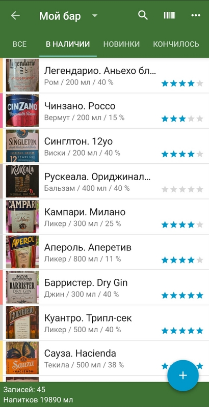
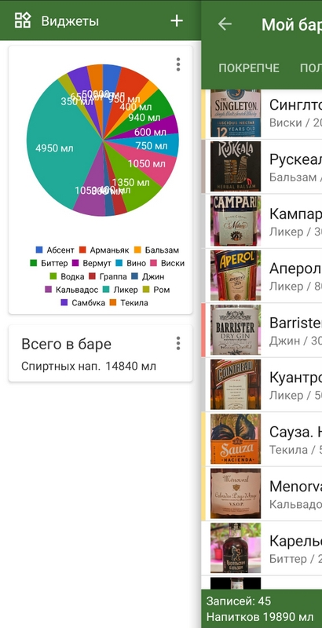

# Библиотека "Мой бар" 

Каталог напитков, ингредиентов вдомашнем баре. 
Реализована на платформе приложения Memento Database.

## Возможности библиотеки
* Ведение учета бара по категориям: алкогольные напитки, безалкогольные напитки, ингредиенты 
* Гибко настроенные карточки 
* Учет остатков, рейтинг
* Включены фильтры, графики, виджеты 

Аддон-библиотеки:
* "Мой бар. Коктейли" (использует зависимую библиотеку "Мой бар") 
 

   

## О приложении Memento Database

Memento Database — позволяет делать полезные справочники (библиотеки) в телефоне и ПК без навыков программиста. 

### Ссылки Memento Database

* [mementodatabase.com](https://mementodatabase.com)
* Приложение [PlayMarket]( https://play.google.com/store/apps/details?id=com.luckydroid.droidbase),  [AppStore]( https://apps.apple.com/us/app/memento-database/id1583610478)
* Приложение для ПК [Win/Mac/Linux](https://mementodatabase.com/download.html)

## Последняя версия в библиотеки в каталоге сервиса

* [Версия 0.2.2](http://libs.mobi/t/6666910777737216)  (22.01.2024)

# Установка библиотеки (для Android)
## Установка через ссылку
* Установить приложение
* Пройти по ссылке последней версии
* Откроется приложение
* Если появится ошибка "Шаблон не найден", возможно вышла новая версия, попробуйте найти библиотеку через каталог
* Нажмите кнопку "Скачать"
* Посмотрите найстройки библиотеки и подтвердите ее создание
* Загруженная библиотека пустая, можно добавлять новые элементы. Будут заполнены меню фильтров, графиков и виджетов.

## Установка через каталог приложений
* Открыть приложение
* Открыть раздел - Мои библиотеки
* Внизу на панели нажать кнопку "Добавить"
* Выбрать пункт - Онлайн каталог
* Открыть раздел Категории / Рецепты, еда и вино
* Справа вверху "Три точки" / Фильтр по языку / Русский
* Найти приложение "Мой бар" пользователя vladshestakov
* Нажмите кнопку "Скачать"
* Посмотрите найстройки библиотеки и подтвердите ее создание
* Загруженная библиотека пустая, можно добавлять новые элементы. Будут заполнены меню фильтров, графиков и виджетов.

# Рекомендации к использованию
Бесплатный аккаунт Memento позволяет выгрузить в облако до 100Мб информации.

Если храненить библиотеки в телефоне, без облака, то ограничений на объем нет.
Уменьшить объем библиотеки можно за счет фотограйиф. Загружайте фото через ссылки из интернета или уменьшайте разрешение фото до экранного (например до 450 пикселей). Так, 40 картинок могут занять 3,5Мб.

